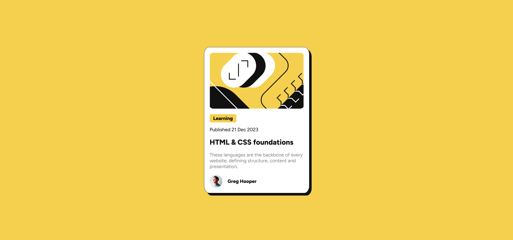

# Live Site URL: [https://blog-preview-card-sriveer.netlify.app/](https://blog-preview-card-sriveer.netlify.app/)

## Frontend Mentor - Blog preview card solution

This is a solution to the [Blog preview card challenge on Frontend Mentor](https://www.frontendmentor.io/challenges/blog-preview-card-ckPaj01IcS). Frontend Mentor challenges help you improve your coding skills by building realistic projects. 

## Table of contents
  - [Screenshot](#screenshot)
  - [Links](#links)
  - [Author](#author)

### Screenshot

### Links

- Solution URL: [https://github.com/sriveer-me/blog-preview-card.git](https://github.com/sriveer-me/blog-preview-card.git)
- Live Site URL: [https://blog-preview-card-sriveer.netlify.app/](https://blog-preview-card-sriveer.netlify.app/)

### Built with

- SCSS
- Parcel
- Flexbox

### Author

- Website - [https://veeru-portfolio.netlify.app/](https://veeru-portfolio.netlify.app/)
- Frontend Mentor - [@sriveer-me](https://www.frontendmentor.io/profile/sriveer-me)
- Twitter - [@empyrean__sama](https://www.twitter.com/empyrean__sama)